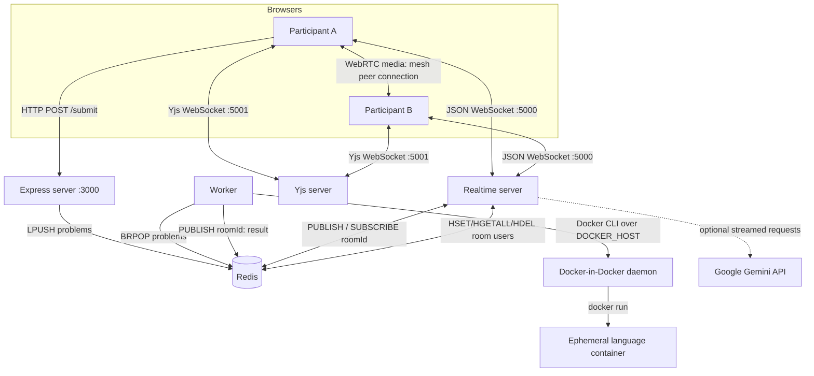
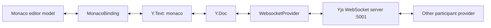
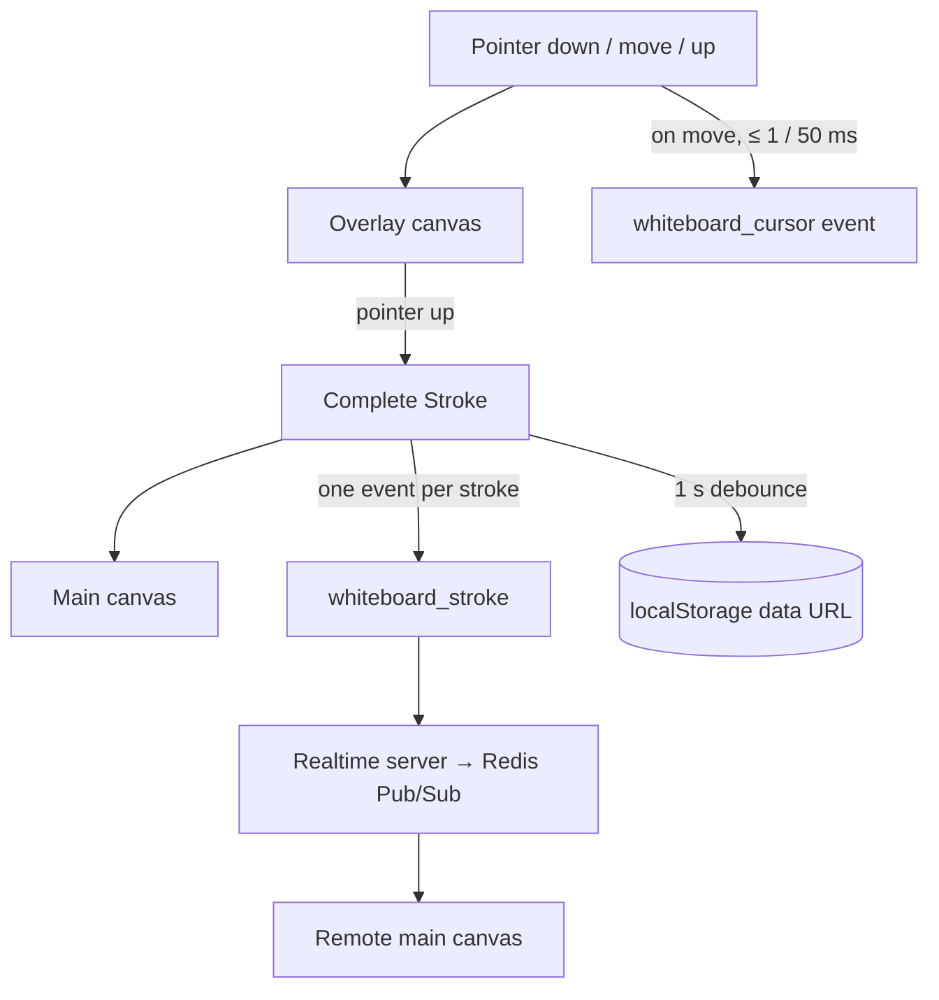
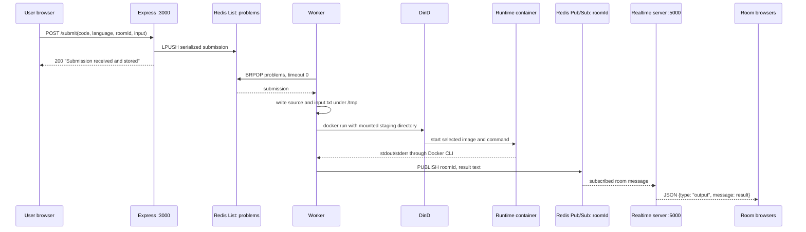
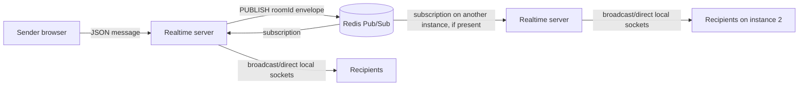
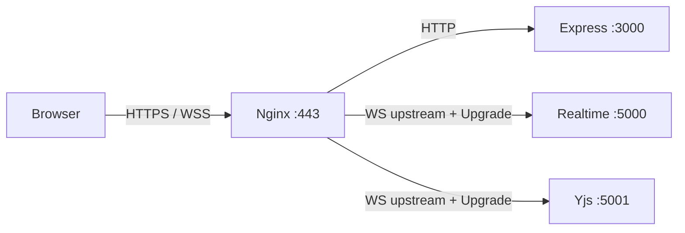
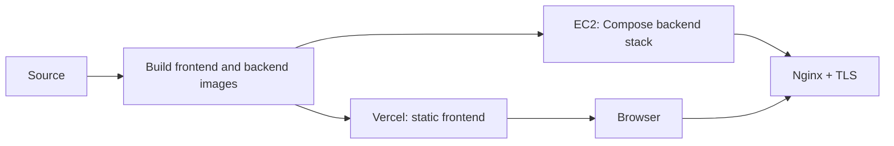

# CodeCanvas Architecture

**Status:** implementation-aligned architecture specification  
**Scope:** the code and container configuration currently in this repository

## Contents

1. [Introduction](#1-introduction)
2. [High-Level System Architecture](#2-high-level-system-architecture)
3. [Repository Architecture](#3-repository-architecture)
4. [Frontend Architecture](#4-frontend-architecture)
5. [Backend Architecture](#5-backend-architecture)
6. [Request Flow](#6-request-flow)
7. [Collaboration Flow](#7-collaboration-flow)
8. [Docker Architecture](#8-docker-architecture)
9. [Redis Architecture](#9-redis-architecture)
10. [Code Execution Pipeline](#10-code-execution-pipeline)
11. [WebSocket Protocol](#11-websocket-protocol)
12. [Data Models](#12-data-models)
13. [Deployment Architecture](#13-deployment-architecture)
14. [Security Architecture](#14-security-architecture)
15. [Scalability](#15-scalability)
16. [Performance Considerations](#16-performance-considerations)
17. [Known Limitations](#17-known-limitations)
18. [Future Roadmap](#18-future-roadmap)
19. [Conclusion](#19-conclusion)

---

## 1. Introduction

### Purpose

CodeCanvas is a browser-based collaborative coding workspace. A room combines a Monaco editor, Yjs document synchronization, shared input/language/run state, Docker-backed code execution, chat, an HTML Canvas whiteboard, and WebRTC audio/video signaling.

### Goals

- Let participants join a room from an invite URL and work in the same editor.
- Decouple code execution from browser requests by using a Redis queue and a worker.
- Keep transient collaboration events low-latency through WebSockets and Redis Pub/Sub.
- Execute the currently supported languages in disposable Docker containers.
- Keep the frontend and backend independently runnable from an npm-workspaces/Turborepo repository.

### Design philosophy

The system separates concerns by transport and workload:

- **Yjs over a dedicated WebSocket** owns concurrent editor text.
- **JSON WebSocket events** own presence, chat, whiteboard, UI state, and WebRTC signaling.
- **Redis Lists** decouple HTTP submission from code execution.
- **Redis Pub/Sub** routes room-scoped transient events and execution output.
- **Docker** runs submitted programs outside the Node.js worker process.

This is a transient collaboration system, not a durable workspace service: the repository does not implement accounts, authorization, persistent room records, or durable chat/document/whiteboard storage.

### Problems addressed

| Problem                    | Current mechanism                                                  |
| -------------------------- | ------------------------------------------------------------------ |
| Concurrent code edits      | Yjs CRDT document bound to Monaco through `y-monaco`               |
| Room coordination          | A custom `ws` server and Redis room channels                       |
| Non-blocking code runs     | Express producer → Redis List → worker consumer                    |
| Multiple runtime languages | Per-language Docker images and commands                            |
| Collaborative sketching    | Two layered canvases; committed strokes are room events            |
| Audio/video setup          | WebRTC peer mesh, with WebSocket signaling and public STUN servers |

---

## 2. High-Level System Architecture



### Component communication

| Source          | Destination     | Transport              | Purpose                                                                                             |
| --------------- | --------------- | ---------------------- | --------------------------------------------------------------------------------------------------- |
| Browser         | Express         | HTTP JSON              | Submit `{ code, language, roomId, input }` to `POST /submit`.                                       |
| Browser         | Realtime server | WebSocket JSON         | Room assignment, presence, UI synchronization, chat, whiteboard, WebRTC signaling, and AI requests. |
| Browser         | Yjs server      | Yjs WebSocket protocol | CRDT updates and awareness for the Monaco document.                                                 |
| Express         | Redis           | Redis List             | Pushes serialized submissions to `problems`.                                                        |
| Worker          | Redis           | Redis List and Pub/Sub | Blocks for jobs, then publishes output to the room channel.                                         |
| Realtime server | Redis           | Redis Hash and Pub/Sub | Stores user names per room and fans room events out to local sockets.                               |
| Worker          | DinD            | Docker CLI / TCP       | Creates language runtime containers through `DOCKER_HOST=tcp://dind:2375` in Compose.               |
| Browser         | Browser         | WebRTC                 | Carries media after signaling; the server does not relay media.                                     |

The checked-in Compose topology exposes API, realtime, Yjs, and Redis ports directly. Nginx, AWS, Certbot, and Vercel are deployment patterns documented later; they are not Compose services or application modules in this repository.

---

## 3. Repository Architecture

```text
.
├── apps/
│   ├── frontend/              React/Vite application
│   │   └── src/
│   │       ├── pages/         Landing, join, workspace, and 404 routes
│   │       ├── components/    Editor shell, chat, people, output, whiteboard, UI primitives
│   │       ├── atoms/         Recoil user, socket, and presence state
│   │       ├── hooks/         WebRTC lifecycle and signaling handling
│   │       ├── middleware/    In-memory route guard
│   │       └── utils/         Monaco completion snippets
│   ├── express-server/        HTTP submission producer
│   ├── websocket-server/      JSON realtime router and Yjs WebSocket host
│   └── worker/                Redis consumer and Docker executor
├── docker-compose.yml         Local/container service topology
├── dind.Dockerfile            Docker daemon image with runtime-image preload hook
├── preload-images.sh          Pulls Node, Python, C++, and Go execution images
├── deployment_guide.md        Existing deployment notes
├── ARCHITECTURE.md             This specification
├── package.json               npm workspaces and Turborepo scripts
└── turbo.json                 Build/dev task configuration
```

### Major folders and files

| Location                                      | Responsibility                                                                                                                       |
| --------------------------------------------- | ------------------------------------------------------------------------------------------------------------------------------------ |
| `apps/frontend`                               | Browser UI. Vite serves/builds the SPA; React owns presentation and local interaction state.                                         |
| `apps/frontend/src/components/ui`             | Reusable local UI primitives (buttons, dialogs, tabs, avatars, and related styling helpers); they do not introduce backend behavior. |
| `apps/express-server/src/index.ts`            | The only HTTP API implementation: root response and submission enqueueing.                                                           |
| `apps/websocket-server/src/index.ts`          | Creates the JSON WebSocket server on configurable `PORT` and the Yjs WebSocket server on fixed port `5001`.                          |
| `apps/websocket-server/src/routers/router.ts` | Maps JSON message types to Redis-published broadcast/direct events and optional Gemini streaming.                                    |
| `apps/worker/src/index.ts`                    | Stages source/input, chooses a runtime command, starts Docker, publishes output, and removes temporary files.                        |
| `apps/*/Dockerfile`                           | Builds Node services; API and realtime use two stages, while the worker also installs the Docker CLI.                                |
| `docker-compose.yml`                          | Runs `redis`, API, realtime, `dind`, and worker on Compose's default network.                                                        |
| `apps/worker/doc`                             | Generated TypeScript documentation assets; not used by runtime services.                                                             |

---

## 4. Frontend Architecture

### React application and routing

`main.tsx` mounts `App` inside `RecoilRoot` and adds a Sonner toast host. `App.tsx` uses `BrowserRouter` with these routes:

| Path            | Component                              | Behavior                                             |
| --------------- | -------------------------------------- | ---------------------------------------------------- |
| `/`             | `Landing`                              | Product landing page.                                |
| `/join`         | `Register`                             | Enter a display name, create a room, or join a room. |
| `/:roomId`      | `Register`                             | Prefills the room ID from an invite URL.             |
| `/code/:roomId` | `CodeEditor` through `ProtectedRouter` | Main workspace; requires in-memory user state.       |
| `*`             | `NotFound`                             | Fallback page.                                       |

`ProtectedRouter` only checks Recoil's `user.id` and `user.roomId`; it is a client-side navigation guard, not authentication. A page refresh resets that state and redirects to the room-entry path.

### State management

| State                | Owner                    | Contents                                                                  |
| -------------------- | ------------------------ | ------------------------------------------------------------------------- |
| `userAtom`           | Recoil                   | Client-generated ID, entered display name, assigned room ID.              |
| `socketAtom`         | Recoil                   | One browser `WebSocket` instance for the JSON realtime endpoint.          |
| `connectedUsersAtom` | Recoil                   | Server-provided array of `{ id, name }` values.                           |
| Workspace state      | `CodeEditor` React state | Language, standard input, output, run status, chat, active tab/view.      |
| Whiteboard state     | `Whiteboard` refs/state  | Canvases, local path, tool, cursor positions, and a local image snapshot. |
| Media state          | `useWebRTC`              | Local stream, peer connections, remote streams, and mic/camera state.     |

### Monaco and collaboration layer

On Monaco mount, `CodeEditor` creates a `Y.Doc`, obtains `doc.getText('monaco')`, opens a `WebsocketProvider`, and binds it to Monaco through `MonacoBinding`. The room ID is the provider room name. Provider awareness contains a random color and the current display name.



The document text is CRDT-synchronized by Yjs. A local observer writes the current text into `localStorage` as `synccode_{roomId}` after 1.5 seconds of inactivity, but the implementation does not read that key back to restore the editor and does not configure server persistence.

### Frontend API and WebSocket use

- `handleSubmit` posts the editor value, selected language, room ID, and standard input to `${VITE_PRIMARY_BACKEND_URL}/submit`.
- The join screen creates `new WebSocket(`${VITE_WS_URL}?roomId=...&id=...&name=...`)` and waits for the `roomId` response before routing into the workspace.
- Workspace state uses the JSON socket to request users/current state, synchronize input/language/button state, send chat and whiteboard events, and perform WebRTC signaling.
- `VITE_YJS_WEBSOCKET_URL` chooses the Yjs endpoint. If absent, the fallback is `ws://<current hostname>:5001`.

### Whiteboard design

The whiteboard preserves the useful properties of the original whiteboard architecture note:



Two 1600×900 stacked canvases are used. The upper overlay receives pointer/touch events and is cleared/redrawn while the current stroke changes; the lower canvas holds committed local and remote strokes. A completed `Stroke` contains points, line width, tool, author, and timestamp. Remote rendering calls the same stroke renderer. Cursor messages are throttled to 50 ms and remote cursors are removed after three seconds of inactivity. The eraser is a stroke drawn in the board background color (`#0b1020`); it is not geometric deletion or undo.

### WebRTC

`useWebRTC` requests audio/video on mount, maintains a peer connection per other connected user, and exchanges WebRTC messages over the JSON WebSocket. It uses Google's public STUN endpoints and a perfect-negotiation-style collision strategy: the lexicographically greater user ID behaves as the polite peer. Tracks are added/removed when mic or camera is toggled. There is no configured TURN server or media SFU.

---

## 5. Backend Architecture

### Express server

The Express service enables JSON parsing and unrestricted `cors()`. It connects one Redis client using `REDIS_URL`.

| Endpoint       | Behavior                                                                                                                                                                       |
| -------------- | ------------------------------------------------------------------------------------------------------------------------------------------------------------------------------ |
| `GET /`        | Returns `Hello World!`.                                                                                                                                                        |
| `POST /submit` | Reads `code`, `language`, `roomId`, and `input`; generates `submission-{timestamp}-{roomId}`; `LPUSH`es a serialized submission to `problems`; returns success or a 500 error. |

It does not run code, query execution status, authenticate callers, validate the submission schema, or persist submissions outside Redis.

### Realtime and WebSocket server

The realtime process opens two independent HTTP/WebSocket servers:

| Port             | Server                                | Responsibility                                                                                               |
| ---------------- | ------------------------------------- | ------------------------------------------------------------------------------------------------------------ |
| `PORT` or `5000` | Custom `ws` server                    | Room assignment, in-memory local socket lists, Redis-backed presence, message routing, and Gemini streaming. |
| `5001`           | `y-websocket` via `setupWSConnection` | Yjs protocol endpoint.                                                                                       |

On a JSON socket connection, `roomId`, `id`, and `name` are parsed from the query string. If this process has no local `rooms[roomId]` array, it creates one (and generates an ID if no room ID was supplied), then sends a `roomId` message. It records the socket locally and, when ID/name are supplied, writes `userId → name` to Redis. The server publishes an updated user list and subscribes to the room's Redis channel while it has local members.

Incoming JSON is dispatched by `requestRouter`. Router handlers publish either a `broadcast` envelope (all local room users except an optional sender) or a `direct` envelope (only a target user). When the Pub/Sub subscriber receives a non-JSON string—such as worker output—it forwards `{ type: 'output', message }` to every local member.

### Yjs server

The Yjs endpoint is a separate `WebSocketServer` with y-websocket's `setupWSConnection` handler. It shares the process but not the JSON room router. The repository does not configure a y-websocket persistence adapter or Redis awareness adapter, so Yjs document state is process-memory behavior supplied by the library.

### Worker

The worker creates two Redis clients: one blocks on the `problems` List and the other publishes results. Its outer loop reconnects after failures with a five-second delay. For each dequeued payload it writes source and `input.txt` below `/tmp/user-{timestamp}`, selects a language-specific `docker run` command, invokes it using Node's `child_process.exec`, publishes stdout/stderr as raw text on the room channel, and removes the staging directory.

The worker is not a separate HTTP service. The active `processSubmission` call schedules `exec` and returns without awaiting its callback, so the dequeue loop can begin preparing later submissions while earlier Docker commands are still running; there is no application-level concurrency limit.

### Redis

Redis is the transient integration point. It is used for queueing, Pub/Sub, and presence only; there is no configured key expiry, authentication, persistence setting, or result history in this repository.

### Docker execution and Docker-in-Docker

The worker image includes the Docker CLI. In Compose it connects to the `dind` service over internal TCP, not to the host socket. DinD runs `docker:dind` as a privileged service. A startup shell script waits for the daemon, then pulls the four runtime images so later runs can reuse the local DinD image cache.

---

## 6. Request Flow



The Express response acknowledges queuing, not successful execution. The browser learns the result through the realtime path rather than the HTTP response.

---

## 7. Collaboration Flow

### Room creation, join, and presence

```mermaid
sequenceDiagram
  participant C as Browser
  participant S as Realtime server
  participant H as Redis Hash room:{roomId}:users
  participant P as Redis Pub/Sub roomId
  participant O as Other browsers

  C->>S: WS connect ?roomId=&id=&name=
  alt no roomId or no local room on this server
    S->>S: create local room; generate ID only when absent
    S-->>C: roomId, isNewRoom=true
  else local room exists
    S-->>C: roomId, isNewRoom=false
  end
  S->>H: HSET userId name
  S->>H: HGETALL
  S->>P: PUBLISH broadcast(users)
  P-->>S: subscribed local instance
  S-->>O: users array
```

On close, the server removes the socket from its local array, `HDEL`s the user, publishes a refreshed list, and unsubscribes/deletes its local room when its local array becomes empty. The Hash is shared across Redis clients but has no TTL. Room membership has no authorization layer.

### Collaboration planes

| Concern                        | Path                                                            | Notes                                                                                                                               |
| ------------------------------ | --------------------------------------------------------------- | ----------------------------------------------------------------------------------------------------------------------------------- |
| Code text and editor awareness | Browser ↔ Yjs `:5001`                                          | A Yjs room has the same room ID; no custom JSON `code` event is needed for normal editing.                                          |
| Presence                       | Browser → JSON WS → Redis Hash/Pub/Sub → JSON WS                | `users` events carry `{ id, name }` lists.                                                                                          |
| Input, language, run button    | Browser → JSON WS → Redis Pub/Sub → JSON WS                     | Broadcast excludes the initiating user.                                                                                             |
| Initial non-document state     | New browser → `requestForAllData` → another browser → `allData` | Direct relay of language/input/run-state; output is sent by the client but not retained by the server's forwarded `allData` object. |
| Whiteboard                     | Browser → JSON WS → Redis Pub/Sub → JSON WS                     | Strokes/clear/cursors are transient; canvas snapshot is local only.                                                                 |
| Chat and AI output             | Browser/AI → JSON WS → Redis Pub/Sub → JSON WS                  | Chat data is held in React state, not persisted.                                                                                    |
| WebRTC negotiation             | Browser → JSON WS → Redis Pub/Sub → target socket               | Offers, answers, and ICE candidates are direct messages; media is peer-to-peer.                                                     |

### Redis-backed broadcast behavior



The subscriber applies the envelope locally: a broadcast excludes `excludeUserId`; a direct message selects `targetUserId`; plain worker output is wrapped as `output` and sent to all local room sockets.

---

## 8. Docker Architecture

### Compose topology

```mermaid
flowchart TB
  subgraph Compose default network
    Redis[redis:alpine]
    API[express-server]
    WS[websocket-server]
    Worker[worker]
    DinD[dind: privileged]
    API --- Redis
    WS --- Redis
    Worker --- Redis
    Worker -->|tcp://dind:2375| DinD
  end
  Host -->|3000| API
  Host -->|5000, 5001| WS
  Host -->|6379| Redis
  Worker <-->|code-data mounted at /tmp| CodeData[(code-data)]
  DinD <-->|code-data mounted at /tmp| CodeData
  DinD <-->|/var/lib/docker| Cache[(dind-storage)]
```

Compose defines no explicit custom network, so Docker Compose creates and uses its default project network. Service names such as `redis` and `dind` resolve on that network.

| Service            | Image/build                        | Published ports | Relevant configuration                                                                                  |
| ------------------ | ---------------------------------- | --------------- | ------------------------------------------------------------------------------------------------------- |
| `redis`            | `redis:alpine`                     | `6379`          | No custom Redis configuration.                                                                          |
| `express-server`   | `apps/express-server/Dockerfile`   | `3000`          | `REDIS_URL=redis://redis:6379`, `PORT=3000`.                                                            |
| `websocket-server` | `apps/websocket-server/Dockerfile` | `5000`, `5001`  | Redis URL, `PORT=5000`, optional Gemini key injected from `GeminiAPI`.                                  |
| `dind`             | root `dind.Dockerfile`             | none            | `privileged: true`, no Docker TLS certificate directory, volumes for source staging and daemon storage. |
| `worker`           | `apps/worker/Dockerfile`           | none            | Redis URL, `DOCKER_HOST=tcp://dind:2375`, source staging volume.                                        |

### Why DinD is used

The worker itself needs a Docker API to start language runtime containers. DinD provides that daemon as another Compose service, avoiding a `/var/run/docker.sock` mount in the active Compose configuration. The worker and daemon must see the same staged directory because each runtime container mounts it from the daemon's filesystem view; `code-data` is mounted at `/tmp` in both services.

### Container lifecycle and isolation

1. Compose starts DinD; its entrypoint launches the runtime image preloader in the background and starts `dockerd`.
2. A worker creates a per-submission directory in its `/tmp` volume.
3. `docker run` asks DinD to mount that same directory into `/usr/src/app` in a runtime container.
4. The runtime exits and `--rm` removes its container.
5. The worker removes the staged directory. `dind-storage` remains to cache pulled images across DinD restarts.

Each runtime command sets `--network none`, `--memory="512m"`, `--cpus="0.5"`, and `--rm`. It does not set a read-only root filesystem, a non-root runtime user, PID limit, disk quota, seccomp profile, or user namespace in the current implementation.

---

## 9. Redis Architecture

```mermaid
flowchart LR
  API[Express] -->|LPUSH| Q[[List: problems]]
  Q -->|BRPOP| W[Worker]
  W -->|PUBLISH raw output| CH((Channel: roomId))
  RT[Realtime server] <-->|PUBLISH / SUBSCRIBE envelopes| CH
  RT <-->|HSET HGETALL HDEL| H{{Hash: room:{roomId}:users}}
```

| Redis primitive | Key shape             | Writer(s)               | Reader(s)                   | Meaning                                                                           |
| --------------- | --------------------- | ----------------------- | --------------------------- | --------------------------------------------------------------------------------- |
| List            | `problems`            | Express                 | Worker                      | Global submission queue. `LPUSH` plus `BRPOP` gives FIFO behavior for these ends. |
| Pub/Sub channel | `{roomId}`            | Worker, realtime server | Realtime server subscribers | Execution output and room event envelopes. Pub/Sub is not retained.               |
| Hash            | `room:{roomId}:users` | Realtime server         | Realtime server             | User-ID-to-name presence mapping.                                                 |

Redis does not hold a formal Room object, code document, chat log, whiteboard bitmap, execution record, or access control record. A room exists as a combination of a channel name, an optional presence Hash, local server socket arrays, and a Yjs room name.

---

## 10. Code Execution Pipeline

### Supported language mapping

| UI language value | Staged file    | Runtime image         | Command in container                               |
| ----------------- | -------------- | --------------------- | -------------------------------------------------- |
| `javascript`      | `userCode.js`  | `node:18-alpine`      | `node userCode.js < input.txt`                     |
| `python`          | `userCode.py`  | `python:3.9-alpine`   | `python userCode.py < input.txt`                   |
| `cpp`             | `userCode.cpp` | `frolvlad/alpine-gxx` | `g++ userCode.cpp -o a.out && ./a.out < input.txt` |
| `go`              | `userCode.go`  | `golang:1.20-alpine`  | `go run userCode.go < input.txt`                   |

The language dropdown presents these four values. Monaco snippets also register Java and Rust completions, but the worker has no Java or Rust execution case; they are not executable languages in this system.

```mermaid
flowchart TD
  A[Submission HTTP body] --> B[Express serializes job]
  B --> C[(Redis List: problems)]
  C --> D[Worker BRPOP]
  D --> E[Create /tmp/user-{timestamp}]
  E --> F[Write input.txt and source file]
  F --> G{language}
  G -->|javascript| J[Node Alpine]
  G -->|python| P[Python Alpine]
  G -->|cpp| CPP[Alpine g++]
  G -->|go| GO[Go Alpine]
  J --> X[docker run]
  P --> X
  CPP --> X
  GO --> X
  X --> O[Collect stdout or stderr]
  O --> R[PUBLISH room result]
  R --> Z[Delete staging directory]
```

### Stages and behavior

| Stage          | Implementation behavior                                                                                                                                |
| -------------- | ------------------------------------------------------------------------------------------------------------------------------------------------------ |
| Submission     | Browser posts current Monaco value and standard input.                                                                                                 |
| Queue          | Express constructs a timestamp/room-based submission ID and `LPUSH`es JSON.                                                                            |
| Consume        | Worker blocks indefinitely with `BRPOP('problems', 0)`.                                                                                                |
| Stage files    | Worker writes `input.txt` and one source file to `/tmp/user-{timestamp}`.                                                                              |
| Select runtime | `switch (language)` selects one of four preconfigured commands. An unsupported value logs preparation failure and returns without publishing a result. |
| Execute        | Node `exec` runs Docker CLI with a 20,000 ms timeout. Docker receives the resource/network/removal flags above.                                        |
| Capture        | Worker prefers stdout, then stderr; on `exec` error it prefers stderr, then stdout, then the error message.                                            |
| Deliver        | Result text is published to the Redis channel equal to `roomId`.                                                                                       |
| Cleanup        | Callback removes the staging directory recursively and forcibly.                                                                                       |

---

## 11. WebSocket Protocol

### Connection contract

The JSON realtime endpoint is `VITE_WS_URL` / port `5000`. The initial browser connection supplies query parameters:

| Query parameter | Meaning                                                       |
| --------------- | ------------------------------------------------------------- |
| `roomId`        | Requested room ID; blank/absent lets the server generate one. |
| `id`            | Browser-generated client user ID.                             |
| `name`          | User-entered display name.                                    |

The server initially responds with `{ type: 'roomId', roomId, isNewRoom, message }`. All subsequent application messages are JSON objects whose `type` is dispatched by the router.

### Client → server messages

| Type                   | Required/used fields                                                     | Delivery                                  | Current frontend use                                                             |
| ---------------------- | ------------------------------------------------------------------------ | ----------------------------------------- | -------------------------------------------------------------------------------- |
| `requestToGetUsers`    | `roomId` ignored by router; connection room is authoritative             | Broadcast `users`                         | Sent on workspace load.                                                          |
| `requestForAllData`    | none                                                                     | Direct to one other local-room user       | Sent on workspace load.                                                          |
| `allData`              | `userId`, `code`, `input`, `language`, `currentButtonState`, `isLoading` | Direct to `userId`                        | Sent in response to `requestForAllData`.                                         |
| `code`                 | `code`                                                                   | Broadcast excluding sender                | Router supports it; workspace relies on Yjs and treats incoming code as a no-op. |
| `input`                | `input`                                                                  | Broadcast excluding sender                | Sent on standard-input changes.                                                  |
| `language`             | `language`                                                               | Broadcast excluding sender                | Sent from language selector.                                                     |
| `submitBtnStatus`      | `value`, `isLoading`                                                     | Broadcast excluding sender                | Sent before/after submission and on output.                                      |
| `users`                | `users`                                                                  | Broadcast excluding sender                | Router supports it; frontend does not normally originate it.                     |
| `cursorPosition`       | `cursorPosition`                                                         | Broadcast excluding sender                | Router supports it; no current editor UI sender/renderer is present.             |
| `webrtc_offer`         | `targetUserId`, `offer`                                                  | Direct                                    | Sent by `useWebRTC`.                                                             |
| `webrtc_answer`        | `targetUserId`, `answer`                                                 | Direct                                    | Sent by `useWebRTC`.                                                             |
| `webrtc_ice_candidate` | `targetUserId`, `candidate`                                              | Direct                                    | Sent by `useWebRTC`.                                                             |
| `chat_message`         | `text`, optional `imageUrl`, `senderName`, `timestamp`                   | Broadcast excluding sender                | Sent by chat and by the AI-action intent.                                        |
| `whiteboard_stroke`    | `stroke`                                                                 | Broadcast excluding sender                | Sent after a completed local stroke.                                             |
| `whiteboard_clear`     | none                                                                     | Broadcast excluding sender                | Sent on clear.                                                                   |
| `whiteboard_cursor`    | `x`, `y`, `username`                                                     | Broadcast excluding sender                | Sent at most every 50 ms while the pointer moves.                                |
| `ask_ai`               | `messageId`, `prompt`, `code`, `language`                                | Server invokes Gemini; streamed broadcast | Sent for a selected-code action.                                                 |

### Server → client messages

| Type                                                             | Fields                                                         | Source                                   |
| ---------------------------------------------------------------- | -------------------------------------------------------------- | ---------------------------------------- |
| `roomId`                                                         | `roomId`, `isNewRoom`, `message`                               | Connection handling.                     |
| `users`                                                          | `users: Array<{id, name}>`                                     | Presence update or user request.         |
| `requestForAllData`                                              | `userId`                                                       | Direct relay asking a peer for UI state. |
| `allData`                                                        | `code`, `input`, `language`, `currentButtonState`, `isLoading` | Direct relay.                            |
| `input`, `language`, `submitBtnStatus`, `code`, `cursorPosition` | Router-defined fields                                          | Redis Pub/Sub broadcast relay.           |
| `webrtc_offer`, `webrtc_answer`, `webrtc_ice_candidate`          | Signal payload plus `senderId`                                 | Direct relay.                            |
| `chat_message`                                                   | `text`, `imageUrl`, `senderId`, `senderName`, `timestamp`      | Broadcast relay.                         |
| `whiteboard_stroke`, `whiteboard_clear`, `whiteboard_cursor`     | Stroke or cursor payload                                       | Broadcast relay.                         |
| `chat_ai_chunk`                                                  | `messageId`, `text`, AI identity, timestamp                    | Gemini stream chunk.                     |
| `chat_ai_error`                                                  | `messageId`, `error`                                           | Missing key or Gemini failure.           |
| `output`                                                         | `message`                                                      | Plain Redis Pub/Sub payload from worker. |

### Broadcast and direct envelopes

These envelopes are internal Redis payloads, not the browser protocol:

```ts
// Broadcast
{ type: 'broadcast', excludeUserId, data: { type: 'chat_message', ... } }

// Direct
{ type: 'direct', targetUserId, data: { type: 'webrtc_offer', ... } }
```

The subscribed realtime server unwraps `data` before writing it to a browser socket. Unknown inbound types are logged and ignored; malformed JSON is logged and ignored.

---

## 12. Data Models

There is no database schema. These are runtime payloads reconstructed from TypeScript code and Redis operations.

```mermaid
classDiagram
  class Room {
    +roomId: string
    +localSockets: UserConnection[]
    +redisChannel: roomId
    +redisUsersHash: room:{roomId}:users
    +yjsRoom: roomId
  }
  class User {
    +id: string
    +name: string
  }
  class Submission {
    +code: string
    +language: javascript|python|cpp|go
    +roomId: string
    +submissionId: string
    +input: string
  }
  class ExecutionResult {
    +message: string
    +roomId: string
  }
  Room o-- User
  Room --> Submission
  Submission --> ExecutionResult
```

| Model            | Fields / storage                                                                     | Notes                                                                                                   |
| ---------------- | ------------------------------------------------------------------------------------ | ------------------------------------------------------------------------------------------------------- |
| Room             | Local `rooms[roomId]` socket array; Redis channel; optional user Hash; Yjs room name | Not a durable record. A process-local room array is independent from Redis.                             |
| User             | `id`, `name`; stored in `room:{roomId}:users`                                        | IDs are generated by the browser using a five-digit random number.                                      |
| Submission       | `code`, `language`, `roomId`, `submissionId`, `input`; serialized in `problems`      | `submissionId` is generated but is not used for lookup/status/result correlation.                       |
| Execution result | Raw stdout/stderr text published to the room channel                                 | The browser receives `{type: 'output', message}`. No result ID, duration, or memory metric is produced. |
| Stroke           | `points[]`, `lineWidth`, `tool`, `author`, optional `ts`                             | Sent once per completed whiteboard stroke.                                                              |
| Chat message     | Client UUID, text, optional compressed data-URL image, sender fields, timestamp      | Held in browser React state and relayed only.                                                           |

---

## 13. Deployment Architecture

### Local development

The frontend requires browser-facing URLs:

```env
VITE_PRIMARY_BACKEND_URL=http://localhost:3000
VITE_WS_URL=ws://localhost:5000
VITE_YJS_WEBSOCKET_URL=ws://localhost:5001
```

Backend services use `REDIS_URL` (normally `redis://localhost:6379` when not running in Compose). Express optionally uses `PORT`, the realtime service optionally uses `PORT`, and the realtime service optionally uses `GEMINI_API_KEY`. The root `npm run dev` invokes Turborepo; backend workspace `dev` scripts build once and start Node, while Vite provides the frontend development server.

### Docker Compose

`docker compose up --build` builds/runs all backend services. Compose sets service-to-service Redis URLs and sets `DOCKER_HOST=tcp://dind:2375` for the worker. The host-side `GeminiAPI` variable is interpolated into the realtime service as `GEMINI_API_KEY`.

### AWS EC2 and Nginx reverse proxy

An EC2 deployment is described in `deployment_guide.md`, but no Nginx configuration is tracked in this repository. A production arrangement should run Nginx on the host (or an additional managed proxy) in front of the published services, terminate TLS, and forward WebSocket Upgrade headers:



Because the current API and each WebSocket server accept traffic at `/`, distinct hostnames are the simplest unambiguous proxy arrangement:

| Public hostname | Upstream                                     | Frontend value                                |
| --------------- | -------------------------------------------- | --------------------------------------------- |
| `api.<host>`    | `http://127.0.0.1:3000`                      | `VITE_PRIMARY_BACKEND_URL=https://api.<host>` |
| `ws.<host>`     | `http://127.0.0.1:5000` with Upgrade headers | `VITE_WS_URL=wss://ws.<host>`                 |
| `yjs.<host>`    | `http://127.0.0.1:5001` with Upgrade headers | `VITE_YJS_WEBSOCKET_URL=wss://yjs.<host>`     |

Nginx must set `proxy_http_version 1.1`, `Upgrade`, and `Connection: upgrade` for both WebSocket upstreams. Restrict EC2 inbound access to SSH administration, HTTP for certificate issuance/redirect, and HTTPS; keep Redis, 3000, 5000, and 5001 private.

### HTTPS with Certbot and nip.io

Certbot/Let's Encrypt can issue certificates for DNS names whose public A records resolve to the EC2 instance. `nip.io` may be convenient for a short-lived demonstration hostname such as `<public-ip>.nip.io` if it resolves correctly, but it is not application configuration or infrastructure included in this repository. It should be verified against current CA validation rules before relying on it.

For a production domain, configure DNS first, obtain/renew certificates with Certbot, and direct Nginx to the generated certificate paths. This TLS/proxy architecture is deployment guidance, not an implemented service in `docker-compose.yml`.

### Vercel frontend

The repository contains a Vite frontend but no `vercel.json`. It can be deployed as a static Vite build with `apps/frontend` as the project root and `npm run build` as its build command. Configure the three public `VITE_*` values at build time. When Vercel serves HTTPS, all browser-facing backend endpoints must use HTTPS/WSS to avoid mixed-content failures.

### Deployment flow



---

## 14. Security Architecture

### Implemented controls

| Area               | Implemented behavior                                                           | Boundary / caveat                                                              |
| ------------------ | ------------------------------------------------------------------------------ | ------------------------------------------------------------------------------ |
| Runtime networking | `docker run --network none`                                                    | Submitted code cannot use container network interfaces.                        |
| Runtime resources  | `--memory="512m"`, `--cpus="0.5"`, `exec` timeout of 20 seconds                | No PID/disk quota; timeout behavior depends on Docker CLI/process termination. |
| Runtime cleanup    | `--rm` and deletion of `/tmp/user-*` after callback                            | Does not create result history.                                                |
| Worker process     | Worker Dockerfile creates non-root `myuser`                                    | It can still use the configured Docker daemon through its Docker group/CLI.    |
| Image cache        | DinD preloads fixed image names                                                | Images are still external dependencies and are not digest-pinned.              |
| Browser rendering  | Chat images are client-resized before sending; links use `noopener noreferrer` | No server-side payload/content validation is implemented.                      |

### Deployment controls (not present in the checked-in stack)

Nginx TLS termination, Certbot certificates, EC2 Security Group restrictions, Redis authentication/TLS, and binding internal ports only to loopback are recommended deployment controls. They are not configured in `docker-compose.yml` or application source.

### Required hardening before a public multi-tenant deployment

Authentication/authorization, input validation, origin restrictions, rate limits, Redis credentials/TLS, per-user quotas, image pinning/scanning, stronger sandboxing, execution audit logs, and a locked-down Docker runtime are absent. DinD is privileged, which is a substantial trust boundary and must be isolated at the infrastructure level.

---

## 15. Scalability

### Current characteristics

- The worker uses a single Redis List and has no application-level execution concurrency limit.
- Redis Pub/Sub can distribute room messages among realtime server instances, and the subscriber applies them to each instance's local socket list.
- Local `rooms` arrays, Yjs in-memory documents, and y-websocket awareness are process-local.
- WebRTC uses an N-peer mesh: each participant maintains a connection to every other participant.
- DinD performs runtime container startup/compilation for every run; image caching reduces pull latency but not startup cost.

### Horizontal scaling opportunities

| Layer           | Possible direction                                                  | Current prerequisite/gap                                                                           |
| --------------- | ------------------------------------------------------------------- | -------------------------------------------------------------------------------------------------- |
| Workers         | Run more worker processes/containers against the same Redis queue.  | Add concurrency quotas, monitoring, and stronger execution isolation.                              |
| Redis           | Use a managed/private Redis deployment or replica/cluster strategy. | Preserve List, Hash, and Pub/Sub semantics; add credentials/TLS.                                   |
| JSON WebSockets | Run multiple realtime instances with shared Pub/Sub.                | Use sticky/load-balanced connections and address process-local room lifecycle/presence edge cases. |
| Yjs             | Use a shared persistence/broadcast adapter or sticky routing.       | Current y-websocket state is not distributed/durable.                                              |
| WebRTC          | Move from mesh to a TURN/SFU architecture for larger rooms.         | No TURN/SFU integration exists.                                                                    |
| Execution       | Use isolated per-job infrastructure or a dedicated runner pool.     | Current privileged DinD is a high-trust single-host component.                                     |

---

## 16. Performance Considerations

| Area                  | Current behavior                                                                                             | Consequence                                                                                        |
| --------------------- | ------------------------------------------------------------------------------------------------------------ | -------------------------------------------------------------------------------------------------- |
| WebSocket connections | Each room connection lives in a local in-memory array; subscribers are attached when first locally occupied. | Low routing overhead locally; memory/process ownership grows with active sockets.                  |
| Redis queue           | `BRPOP` blocks instead of polling.                                                                           | No idle busy loop; one global queue has no prioritization or back-pressure policy.                 |
| Redis Pub/Sub         | Events are delivered only to current subscribers.                                                            | Low-latency transient delivery; disconnected clients cannot replay missed messages.                |
| Whiteboard            | Cursor messages throttle at 50 ms; full stroke sends on pointer up; canvas snapshot debounces 1 second.      | Avoids per-point network events and repeated `toDataURL()` work.                                   |
| Editor persistence    | Yjs performs incremental document sync; browser writes a debounced local value.                              | Collaborative edits converge; local value is not restored by current code.                         |
| Docker                | DinD pre-pulls four images into `dind-storage`.                                                              | Reduces cold pulls; program start, compilation, mount, and container startup remain per-run costs. |
| Chat images           | Browser resizes to max 800 px and JPEG quality 0.6.                                                          | Reduces payload size, but there is no server-enforced maximum message/payload policy.              |
| Media                 | Mesh WebRTC sends streams directly among peers.                                                              | Avoids server media relay, but bandwidth/connection count grows with participants.                 |

---

## 17. Known Limitations

The following are observed from the current implementation:

- There is no user authentication, room authorization, server-side session persistence, or protected backend endpoint.
- User IDs are browser-generated random five-digit strings and can collide; display names and room IDs are client-supplied.
- Redis room presence has no TTL. An abnormal disconnect can leave stale data until a close handler runs or another action changes it.
- A server that has no local room array treats a requested room as new even if another realtime instance or Redis has that room; the `isNewRoom` flag is therefore local-process semantics.
- Yjs documents are not persisted or shared through Redis. Multi-instance Yjs deployment requires additional routing/adapters.
- Chat, whiteboard, output, and room state are transient; whiteboard and code localStorage behavior is browser-local, and the code key is written but not read by the editor.
- The initial `allData` response forwards language, input, code, and run state but omits output even though the client includes it in its sent payload.
- The frontend assumes configured `VITE_PRIMARY_BACKEND_URL` and `VITE_WS_URL`; only the Yjs URL has a fallback.
- The `fetch` submission path has no local `try/catch`, no cancellation, and does not correlate output with a submission ID.
- Worker output is raw stdout/stderr text and does not include execution duration, memory use, exit code, or a result ID.
- Unsupported worker language values return during preparation without publishing an error to the room.
- The worker creates Docker commands through `exec`; no explicit scheduler, per-user quota, PID/disk limit, runtime read-only filesystem, or hardened Docker policy exists.
- Default Compose publishes Redis and backend ports to the host and has no health checks, authentication, or TLS.
- WebRTC has public STUN only; users behind some NAT/firewall environments may not establish media.

---

## 18. Future Roadmap

These are proposed architectural improvements, not present features.

- Add authenticated identities, room membership/authorization, and secure invite semantics.
- Add request schemas, payload limits, origin controls, rate limiting, and Redis security.
- Persist room metadata, execution records, chat, whiteboard operations, and Yjs documents.
- Introduce a distributed Yjs persistence/broadcast architecture and explicit WebSocket scaling strategy.
- Harden execution with dedicated runner isolation, quotas, disk/PID controls, image pinning, and audit/observability.
- Add per-submission status/result correlation, cancellation, and controlled worker concurrency.
- Add TURN and, when needed, an SFU for reliable/scalable audio/video.
- Add health checks, CI tests, metrics, structured logs, and production deployment manifests.

---

## 19. Conclusion

CodeCanvas deliberately splits collaborative editing, realtime events, and code execution into separate paths. Yjs and Monaco handle concurrent text; the JSON realtime service and Redis coordinate the rest of the room; Express and Redis List enqueue execution; and the worker delegates language runs to disposable Docker containers through DinD. This provides a clear prototype architecture for synchronous coding sessions while retaining explicit boundaries for the authentication, persistence, distributed-state, and sandbox hardening work required for broader production use.
