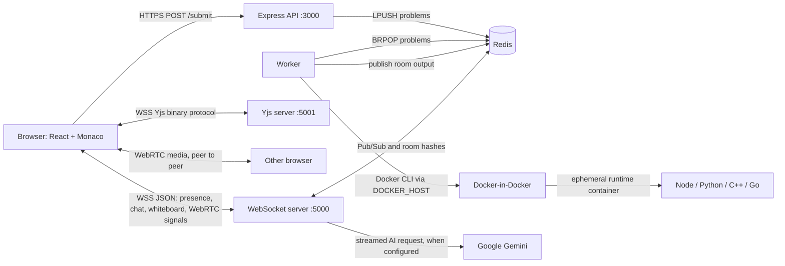
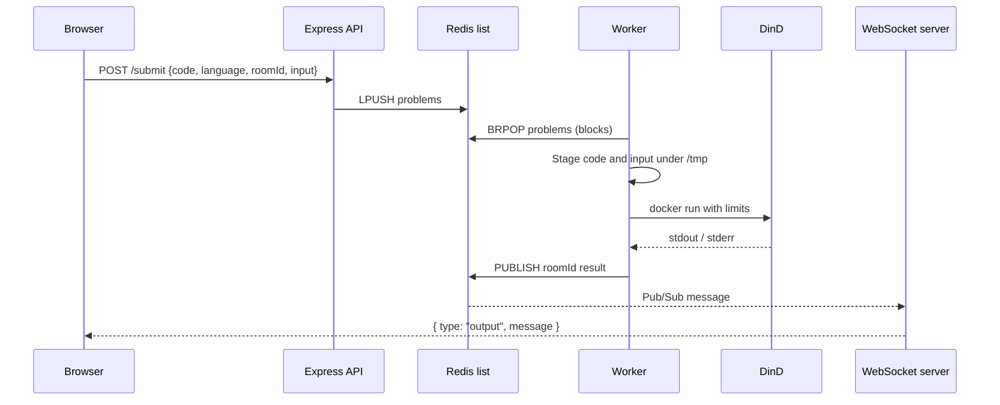

# CodeCanvas

> A collaborative browser workspace for writing, running, and discussing code together.

CodeCanvas combines a Monaco-based editor, conflict-free Yjs document sync, shared execution controls, a collaborative whiteboard, room chat, and peer-to-peer camera/audio. It is an npm-workspaces/Turborepo monorepo with independently deployable frontend, API, realtime, and worker services.

> **Project status:** active prototype. Rooms, presence, chat history, whiteboard state, and Yjs documents are not durably persisted by the current implementation.

## Contents

- [Features](#features)
- [Architecture](#architecture)
- [Services and communication paths](#services-and-communication-paths)
- [Quick start](#quick-start)
- [Environment variables](#environment-variables)
- [Docker deployment](#docker-deployment)
- [AWS EC2 deployment](#aws-ec2-deployment)
- [Repository structure](#repository-structure)
- [Security considerations](#security-considerations)
- [Roadmap](#roadmap)

## Screenshots and demo media

| Collaborative editor | Shared whiteboard |
| --- | --- |
|  |  |

<!-- Media placeholders: add `docs/assets/workspace.gif`, `docs/assets/video-call.png`, and `docs/assets/mobile.png` when new captures are available. -->

## Features

- Room creation and invite-link joining with live participant presence.
- Concurrent text editing with Monaco, Yjs, `y-monaco`, and `y-websocket`.
- Run JavaScript, Python, C++, or Go against standard input in short-lived Docker containers.
- Shared language, standard input, execution status, and output delivery.
- Group chat with Markdown rendering and client-side resized image attachments.
- Optional Gemini-powered actions for selected code: explain, find bugs, and optimize.
- Browser-to-browser audio/video using WebRTC mesh connections and STUN servers.
- Collaborative pen/eraser whiteboard, remote cursors, and per-room browser-local snapshots.
- Responsive React/Vite interface with copyable room links.

## Architecture



The supplied Compose file runs Redis, the API, realtime server, worker, and a privileged Docker-in-Docker (DinD) daemon. The worker and DinD share a `/tmp` volume so execution containers can mount staged user files.

### Code execution flow



## Services and communication paths

| Service | Role | Interfaces |
| --- | --- | --- |
| `apps/frontend` | React/Vite single-page app. Hosts Monaco, whiteboard, chat, and WebRTC UI. | REST to API; JSON WebSocket to `:5000`; Yjs WebSocket to `:5001`; direct WebRTC media to peers. |
| `apps/express-server` | Accepts submissions. `POST /submit` puts a job on Redis; `GET /` returns a basic health response. | HTTP `:3000`; Redis List. |
| `apps/websocket-server` | Creates/joins rooms, tracks presence, relays realtime events, hosts the Yjs WebSocket server, and optionally streams Gemini responses. | JSON WebSocket `:5000`; Yjs WebSocket `:5001`; Redis Pub/Sub and Hashes; Gemini API when enabled. |
| `apps/worker` | Blocks on jobs, stages files, invokes Docker, publishes output, and deletes the staging directory. | Redis List/Pub/Sub; Docker CLI. |
| Redis | Shared transient coordination layer. | `problems` List, room-named Pub/Sub channels, `room:{roomId}:users` Hashes. |
| DinD | Docker daemon used by the worker in the default Compose topology. Preloads runtime images at startup. | TCP `dind:2375`; named volumes for Docker cache and staged code. |

### Realtime paths

**JSON WebSocket (`:5000`).** The frontend connects with `roomId`, user id, and name. The server stores presence in `room:{roomId}:users`, publishes updates on the room channel, and routes messages to connected clients. It carries user lists, input/language state, run-button state, output, chat, whiteboard events, and WebRTC offers, answers, and ICE candidates. Code text itself is not sent on this channel.

**Yjs WebSocket (`:5001`).** On editor mount, the frontend creates a `Y.Doc` and joins a Yjs room named after the CodeCanvas room. `MonacoBinding` synchronizes the shared `Y.Text` named `monaco` with Monaco and exposes Yjs awareness for collaborators. This CRDT path is separate from JSON events so concurrent code edits converge independently of presence/chat messaging.

**Redis.** Express uses `LPUSH problems`; the worker waits with `BRPOP problems`. The worker publishes result text to the room's Redis Pub/Sub channel. The realtime server subscribes to active local rooms and forwards that text as output. It also uses Redis Pub/Sub to relay JSON realtime events and a Hash for room presence. Redis has no configured persistence, expiry, or authentication in the checked-in Compose file.

**WebRTC.** The realtime server is only a signaling relay. Browsers obtain camera/microphone tracks, exchange offers/answers/ICE candidates over the JSON WebSocket, and then attempt direct mesh peer connections using Google public STUN servers. A TURN server is not configured, so some restrictive NAT/firewall combinations will not connect.

**Whiteboard.** Two stacked canvases keep the local in-progress stroke separate from committed drawing. A completed stroke is broadcast once on pointer release; cursor coordinates are throttled to one update per 50 ms. The board is saved to browser `localStorage` after a one-second debounce. This is local recovery rather than shared persistence.

**AI.** If `GEMINI_API_KEY` is present, an `ask_ai` event sends the selected code and prompt to `gemini-2.5-flash-lite`; streamed chunks return through the room channel. Without the key, the server returns a configuration error to the room.

### Docker execution

The worker writes each submission and `input.txt` to a unique `/tmp/user-*` directory, then runs a language image with a working-directory mount. The command uses `--rm`, `--network none`, `--memory="512m"`, `--cpus="0.5"`, and a 20-second host-side `exec` timeout. The current runtime images are `node:18-alpine`, `python:3.9-alpine`, `frolvlad/alpine-gxx`, and `golang:1.20-alpine`. The staging directory is removed after Docker returns.

## Quick start

### Prerequisites

- Node.js 18 or later (the repository declares `>=18`)
- npm 10.8.1 or compatible
- Docker Engine and Docker Compose v2 for code execution
- A reachable Redis instance for non-Compose local development

### 1. Install dependencies

```bash
git clone <your-fork-or-repository-url>
cd CodeCanvas
npm install
```

### 2. Configure local environment files

Create these files; do not commit them.

`apps/frontend/.env.local`

```env
VITE_PRIMARY_BACKEND_URL=http://localhost:3000
VITE_WS_URL=ws://localhost:5000
VITE_YJS_WEBSOCKET_URL=ws://localhost:5001
```

`apps/express-server/.env`, `apps/websocket-server/.env`, and `apps/worker/.env`

```env
REDIS_URL=redis://localhost:6379
```

Add `PORT=3000` to the Express file if you do not want its default. Add `PORT=5000` and optionally `GEMINI_API_KEY=...` to the WebSocket server file.

### 3. Start dependencies and services

The most reliable development path is to run Redis and the backend execution stack with Compose:

```bash
# At the repository root; GeminiAPI is optional
docker compose up --build
```

For frontend iteration in a second terminal:

```bash
npm run dev --workspace=frontend
```

Vite prints the local URL (normally `http://localhost:5173`). With Compose running, point the frontend environment variables at `localhost:3000`, `localhost:5000`, and `localhost:5001` as shown above.

For a fully host-native backend, start Redis and a Docker daemon reachable by the worker, then run each workspace's `npm run dev`. `npm run dev` at the repository root delegates to Turborepo; note that the backend `dev` scripts compile once and start Node rather than providing source watch mode.

### Build and lint

```bash
npm run build
npm run lint
```

## Environment variables

| Variable | Used by | Required | Default / purpose |
| --- | --- | --- | --- |
| `VITE_PRIMARY_BACKEND_URL` | Frontend | Yes | Base URL for `POST /submit`, e.g. `http://localhost:3000`. Exposed in the browser at build time. |
| `VITE_WS_URL` | Frontend | Yes | JSON realtime WebSocket endpoint, e.g. `ws://localhost:5000`. |
| `VITE_YJS_WEBSOCKET_URL` | Frontend | No | Yjs endpoint. If absent, the app uses `ws://<current-host>:5001`. |
| `REDIS_URL` | Express, WebSocket server, Worker | Yes | Redis URL, e.g. `redis://localhost:6379`; Compose sets `redis://redis:6379`. |
| `PORT` | Express, WebSocket server | No | Express defaults to `3000`; realtime JSON WebSocket defaults to `5000`. The Yjs server is fixed at `5001`. |
| `GEMINI_API_KEY` | WebSocket server | No | Enables Gemini code-assistant streaming. If absent, AI requests receive an error response. |
| `GeminiAPI` | Docker Compose host environment | No | Compose interpolation source for the WebSocket container's `GEMINI_API_KEY`. Put it in root `.env` before `docker compose up`. |
| `DOCKER_HOST` | Worker / Docker CLI | Compose only | `tcp://dind:2375`, directing the worker to the DinD daemon. For host development, use your local Docker daemon instead. |
| `DOCKER_TLS_CERTDIR` | DinD | Compose only | Empty in Compose to expose the daemon on its non-TLS internal TCP endpoint. |

`VITE_*` values are public client configuration, not secret storage. Keep Redis credentials and Gemini keys out of version control; `.env` is ignored by this repository.

## Docker deployment

The checked-in [docker-compose.yml](docker-compose.yml) is the supported all-backend topology. It exposes Redis `6379`, API `3000`, and WebSocket/Yjs `5000`/`5001` on the host, and creates persistent `code-data` and `dind-storage` volumes.

```bash
# Optional: enables AI in the Compose WebSocket service
printf 'GeminiAPI=your-key\n' > .env

docker compose up -d --build
docker compose ps
docker compose logs -f websocket-server worker
```

DinD is intentionally `privileged` and has no published host port. The worker reaches it over the Compose network and shares only the named code volume. On a production host, treat this as a high-trust deployment: it can run arbitrary execution containers and pull images. Keep the Compose network and Docker API private.

To stop the stack without deleting data volumes:

```bash
docker compose down
```

## AWS EC2 deployment

This is an implementation-aligned production outline based on `deployment_guide.md`; it adds the reverse proxy required for HTTPS/WSS. A domain name is needed for a trusted TLS certificate.

1. Launch Ubuntu 22.04/24.04 EC2 with sufficient memory for Docker builds and DinD. Allow SSH only from your administration IP, and allow HTTP/HTTPS. Do **not** publicly allow `3000`, `5000`, `5001`, or `6379`.
2. Install Docker Engine plus the Compose plugin, clone the repository, and create a root `.env` containing `GeminiAPI` if AI is wanted.

   ```bash
   git clone <your-fork-or-repository-url> codecanvas
   cd codecanvas
   docker compose up -d --build
   ```

3. Install Nginx and Certbot, point three DNS names at the instance, and issue certificates. Separate hosts are recommended because the current API, JSON WebSocket, and Yjs WebSocket services each expect to receive requests at `/`. With port 80 open, the standalone flow below obtains one certificate per hostname before the TLS configuration is enabled.

   ```bash
   sudo apt update
   sudo apt install -y nginx certbot python3-certbot-nginx
   sudo systemctl stop nginx
   sudo certbot certonly --standalone -d api.example.com
   sudo certbot certonly --standalone -d ws.example.com
   sudo certbot certonly --standalone -d yjs.example.com
   ```

4. Configure Nginx to terminate TLS and proxy API and WebSocket traffic. Put the upstream ports behind the EC2 firewall; for stronger isolation, bind published Compose ports to `127.0.0.1` in a deployment-specific Compose override.

   ```nginx
   # /etc/nginx/sites-available/codecanvas
   server {
     listen 443 ssl http2;
     server_name api.example.com;
     ssl_certificate /etc/letsencrypt/live/api.example.com/fullchain.pem;
     ssl_certificate_key /etc/letsencrypt/live/api.example.com/privkey.pem;
     location / { proxy_pass http://127.0.0.1:3000; }
   }

   server {
     listen 443 ssl http2;
     server_name ws.example.com;
     ssl_certificate /etc/letsencrypt/live/ws.example.com/fullchain.pem;
     ssl_certificate_key /etc/letsencrypt/live/ws.example.com/privkey.pem;
     location / {
       proxy_pass http://127.0.0.1:5000;
       proxy_http_version 1.1;
       proxy_set_header Upgrade $http_upgrade;
       proxy_set_header Connection "upgrade";
       proxy_read_timeout 3600;
     }
   }

   server {
     listen 443 ssl http2;
     server_name yjs.example.com;
     ssl_certificate /etc/letsencrypt/live/yjs.example.com/fullchain.pem;
     ssl_certificate_key /etc/letsencrypt/live/yjs.example.com/privkey.pem;
     location / {
       proxy_pass http://127.0.0.1:5001;
       proxy_http_version 1.1;
       proxy_set_header Upgrade $http_upgrade;
       proxy_set_header Connection "upgrade";
       proxy_read_timeout 3600;
     }
   }
   ```

   Enable the site, test it, and start Nginx:

   ```bash
   sudo ln -s /etc/nginx/sites-available/codecanvas /etc/nginx/sites-enabled/codecanvas
   sudo nginx -t
   sudo systemctl enable --now nginx
   ```

   Nginx is not included in `docker-compose.yml`; in this design it runs on the EC2 host. It terminates TLS and preserves the HTTP Upgrade headers that long-lived WebSocket and Yjs connections require. Add a scheduled `certbot renew` check (or enable the package's renewal timer) so the certificates continue to renew.

5. Build the frontend with production public endpoints (or define the same variables in your static-host provider):

   ```env
   VITE_PRIMARY_BACKEND_URL=https://api.example.com
   VITE_WS_URL=wss://ws.example.com
   VITE_YJS_WEBSOCKET_URL=wss://yjs.example.com
   ```

6. Verify `https://api.example.com/`, room joining, Yjs edits between two browsers, a code run, and WebSocket connections. Monitor with `docker compose ps` and `docker compose logs -f`.

## Repository structure

```text
.
├── apps/
│   ├── frontend/           # Vite/React UI, Monaco, Yjs, WebRTC, whiteboard
│   ├── express-server/     # POST /submit producer
│   ├── websocket-server/   # Realtime router and Yjs server
│   └── worker/             # Redis consumer and Docker executor
├── docker-compose.yml      # Redis + services + Docker-in-Docker topology
├── dind.Dockerfile         # DinD image and runtime-image preloader
├── preload-images.sh       # Pulls language runtime images into DinD cache
├── whiteboard_architecture.md
├── deployment_guide.md
├── turbo.json
└── package.json
```

## Security considerations

The execution worker applies useful controls, but this project should not be treated as a hardened multi-tenant code-execution platform without further security work.

- User execution containers have no network, a 512 MiB memory limit, a 0.5 CPU limit, auto-removal, and a 20-second worker timeout.
- The worker removes staged source files after execution, but untrusted code execution and a privileged DinD daemon remain sensitive. Use a dedicated, isolated host/account; apply image allowlists, user namespaces/rootless isolation where feasible, disk/process limits, monitoring, and egress controls.
- No authentication or authorization is implemented. Room IDs and usernames are client-provided; anyone with a room link can attempt to join.
- Redis is unauthenticated and published by the default Compose file. Do not expose it publicly; use authentication/TLS and a managed/private Redis service in production.
- Chat image data is sent through WebSockets and rendered in the browser. Enforce payload limits and content policies at the proxy/application layer before public deployment.
- AI prompts include selected code. Configure `GEMINI_API_KEY` only when this data-sharing behavior is acceptable, and keep keys server-side.
- Deploy the frontend and all browser-facing backend endpoints over HTTPS/WSS. Browsers require a secure context for camera/microphone access (except local development), and TLS prevents mixed-content failures.
- The current code does not configure rate limiting, CORS restrictions, request validation, Redis TTLs, durable storage, or resource quotas per room/user. Add them before exposing the service broadly.

## Roadmap

Potential next steps, not current features:

- [ ] Authentication, authorization, and room access controls
- [ ] Durable room, chat, whiteboard, and document storage
- [ ] Request validation, size limits, rate limits, and observability
- [ ] Hardened isolated execution infrastructure and per-user quotas
- [ ] TURN support and scalable WebRTC/media architecture
- [ ] Automated tests, health checks, and CI/CD
- [ ] Production Compose/Helm configuration with private service networking

## Acknowledgements

CodeCanvas is built with [React](https://react.dev/), [Vite](https://vite.dev/), [Monaco Editor](https://microsoft.github.io/monaco-editor/), [Yjs](https://yjs.dev/), [y-websocket](https://github.com/yjs/y-websocket), [Redis](https://redis.io/), [Docker](https://www.docker.com/), [Express](https://expressjs.com/), [`ws`](https://github.com/websockets/ws), [WebRTC](https://webrtc.org/), and the [Google Generative AI SDK](https://www.npmjs.com/package/@google/generative-ai). Thanks to the open-source communities that maintain them.
